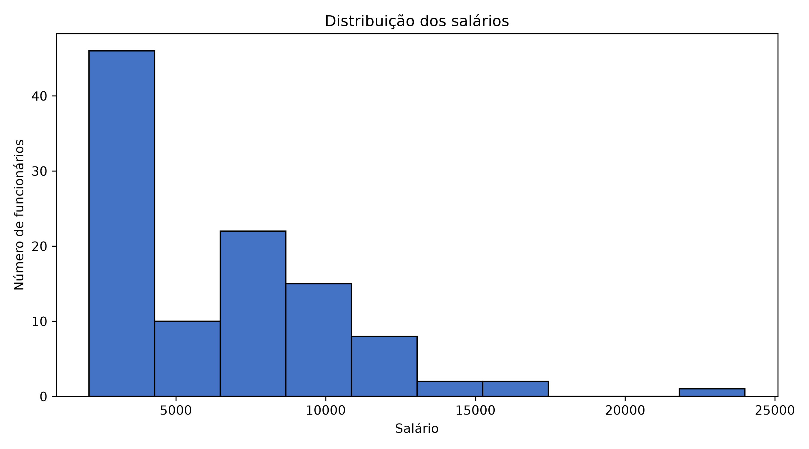
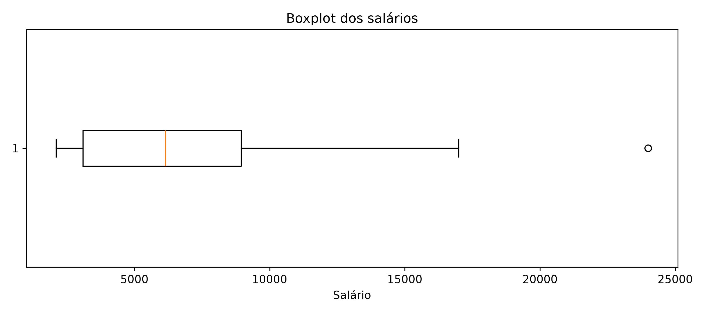
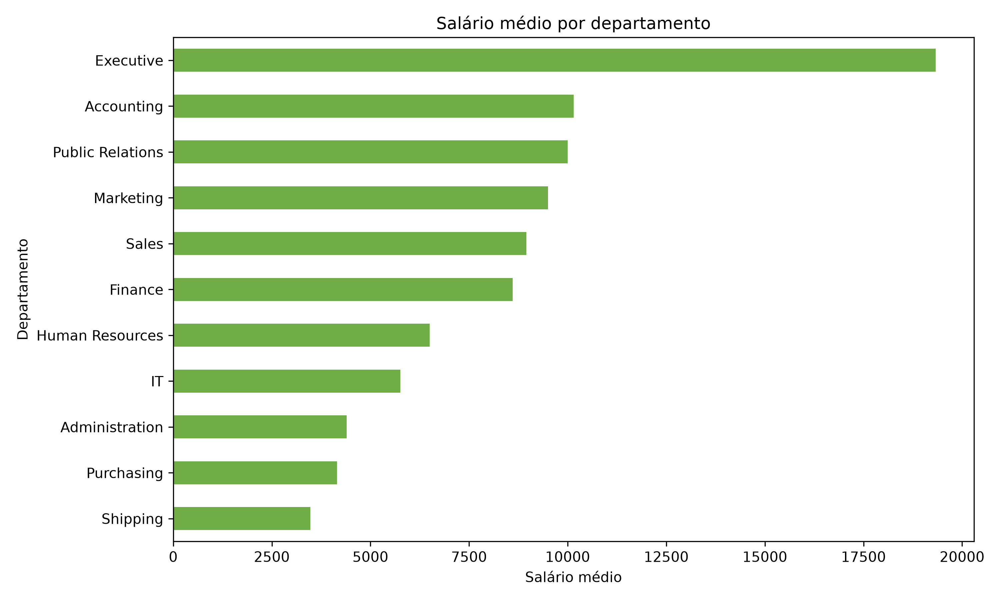

# Análise de Dados de Recursos Humanos

Projeto de análise de dados desenvolvido com informações do esquema **HR (Human Resources)** do banco Oracle, acessado pela plataforma FreeSQL.

## Objetivo

Analisar a distribuição dos salários da empresa considerando cargos, departamentos e localização geográfica dos funcionários.

## Tecnologias utilizadas

- SQL
- Python
- Pandas
- Matplotlib
- Git e GitHub
- Oracle FreeSQL

## Estrutura do projeto

```text
projeto-analise-rh/
├── analise/
│   └── analise_rh.py
├── dados/
│   ├── query_01.csv
│   ├── query_02.csv
│   ├── resumo_cargos.csv
│   ├── resumo_departamentos.csv
│   └── resumo_regioes.csv
├── graficos/
│   ├── boxplot_salarios.png
│   ├── histograma_salarios.png
│   └── salario_medio_departamento.png
├── sql/
│   ├── query_1.sql
│   └── query_2.sql
├── README.md
└── requirements.txt
```

## Consultas SQL

### Query 1 — Salário por departamento e cargo

Relaciona as tabelas de funcionários, departamentos e cargos para analisar a distribuição dos salários de acordo com o departamento e o cargo de cada funcionário.

### Query 2 — Salário e localização geográfica

Relaciona as tabelas de funcionários, departamentos, localizações, países e regiões para identificar padrões geográficos de remuneração.

As consultas utilizam `LEFT JOIN` para preservar os registros dos funcionários mesmo quando alguma informação relacionada não está disponível.

## Análise exploratória

A análise em Python realiza:

- carregamento dos arquivos CSV;
- padronização dos nomes das colunas;
- verificação de valores ausentes;
- estatísticas descritivas dos salários;
- agrupamento por departamento;
- agrupamento por cargo;
- agrupamento por região;
- exportação de tabelas-resumo;
- criação de gráficos.

## Principais resultados

- Foram analisados 106 registros de funcionários.
- A maior parte dos funcionários está concentrada nas faixas salariais mais baixas.
- O departamento **Executive** possui o maior salário médio.
- O departamento **Shipping** possui o menor salário médio.
- Foi identificado um salário de aproximadamente 24.000, considerado um valor atípico em comparação aos demais.
- A região **Europe** apresentou salário médio superior ao da região **Americas**.
- A distribuição salarial é assimétrica, com poucos salários muito elevados.

## Visualizações

### Distribuição dos salários



### Boxplot dos salários



### Salário médio por departamento



## Como executar o projeto

Instale as dependências:

```bash
pip install -r requirements.txt
```

Execute a análise:

```bash
python analise/analise_rh.py
```

Os arquivos de resumo serão gerados na pasta `dados` e os gráficos serão salvos na pasta `graficos`.

## Autora

**Ana Cristina Alves**